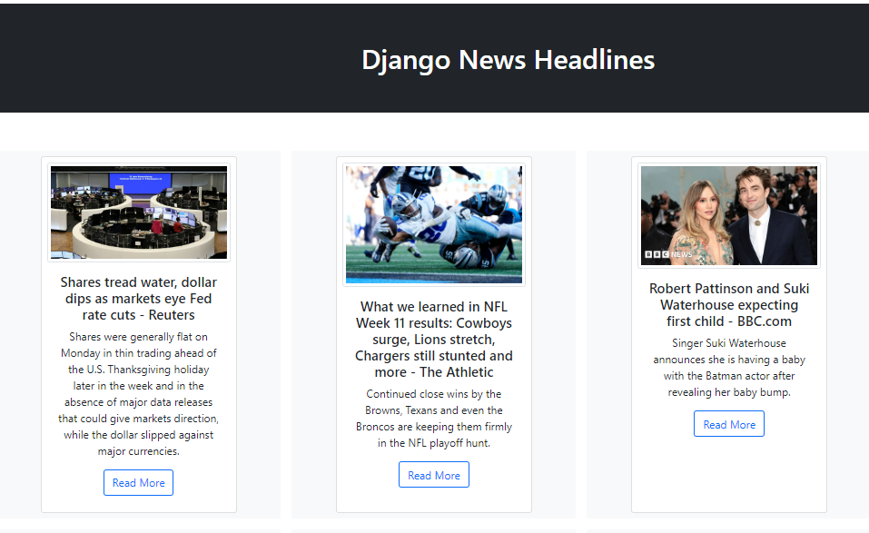

# Django News Aggregation App

A web-based news aggregation application built with Django. Using [News API](https://newsapi.org/)

## Prerequisites

Make sure you have the Python installed:

- Python (version 3.x recommended)

## Note:

In the command line, type `python`. If Python is installed, you should see a message like “Python 3.x.x” followed by the Python prompt, which looks like this “>>>”. Note that “3.x.x” represents the version number of Python

```bash
python
# OR
python --version
```

**1.Clone the Repo**

```sh
git clone https://github.com/Kaiyrtay/Django-newsAggregation.git
```

**2.Install Requirements**

```sh
cd ~/Django-newsAggregation/newsAggregation
pip install -r requirements.txt
```

**3.Create .env**

```sh
cd ~/Django-newsAggregation/newsAggregation
touch .env
```

At your .env file:

```bash
DEBUG=True/False
SECRET_KEY=<your_value>
NEWS_API_KEY=<your_value>   # go to News API https://newsapi.org/ and generate api key
COUNTRY_CODE=<your_value>   # look for newsAggregator\COUNTRY_CODE.txt
```

**4.Start the development server:**

```bash
python manage.py check
python manage.py runserver
```

# Demo:

## Homepage



# End

> Good luck.
